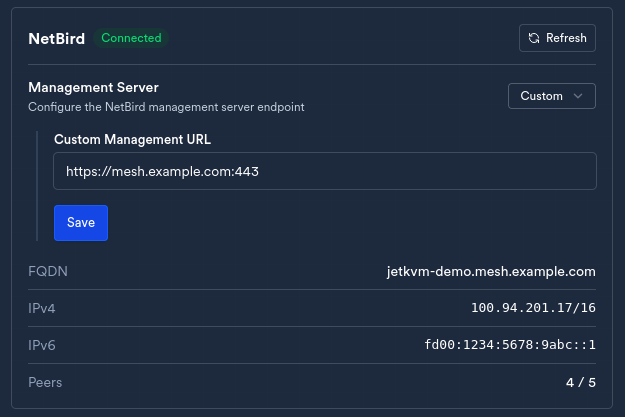

# jetkvm-netbird

Install and manage [NetBird](https://netbird.io) on a [JetKVM](https://jetkvm.com)
device. JetKVM's firmware has no native NetBird support and no package
manager - this repo provides the install, update, and uninstall path,
built to survive both reboots and OTA firmware updates.

## Quick start

Enable Developer Mode and add your SSH key first ([JetKVM
docs](https://jetkvm.com/docs/advanced-usage/developing#developer-mode)).
Then, from your own machine:

```sh
curl -fsSL https://raw.githubusercontent.com/jtbrough/jetkvm-netbird/main/scripts/remote-install.sh \
  | sh -s -- -m https://your-netbird-management-url -k your-setup-key <jetkvm-ip>
```

`-y` skips the confirmation prompt, `-c` wipes existing peer state for a
clean reinstall, `-v` pins a NetBird version. Full flag list in
`scripts/remote-install.sh`'s header.

To review before piping, clone and run locally instead:

```sh
git clone https://github.com/jtbrough/jetkvm-netbird.git
cd jetkvm-netbird
sh scripts/remote-install.sh -m https://your-netbird-management-url -k your-setup-key <jetkvm-ip>
```

Update:

```sh
curl -fsSL https://raw.githubusercontent.com/jtbrough/jetkvm-netbird/main/scripts/remote-update.sh \
  | sh -s -- <jetkvm-ip>
```

Uninstall:

```sh
curl -fsSL https://raw.githubusercontent.com/jtbrough/jetkvm-netbird/main/scripts/remote-uninstall.sh \
  | sh -s -- <jetkvm-ip>
```

## What this handles

Stock JetKVM firmware has no systemd, no CA trust store, and doesn't load
the kernel module NetBird needs. Details in
[docs/jetkvm-behavior.md](docs/jetkvm-behavior.md) and
[docs/netbird-behavior.md](docs/netbird-behavior.md).

- **Durable across OTA updates.** Binary and state live under
  `/userdata`, JetKVM's persistent partition; `/` is replaced on every
  firmware update.
- **Restart supervision.** No systemd - `crond` runs a watchdog every 5
  minutes.
- **TLS trust.** The device has no CA store. A bundle is included and
  refreshed weekly by `refresh-ca-bundle.yml`, which opens a PR on any
  change.
- **Checksum-verified downloads** - the device's own `wget` doesn't
  verify TLS certificates.

Validated with repeated install/update/uninstall/reboot cycles against a
physical device, not just a live SSH session.

## Layout

- `scripts/` - install, update, uninstall, and boot-supervision shell
  scripts. No dependencies beyond what stock JetKVM firmware ships
  (`wget`, `crond`, BusyBox `ash`).
- `internal/netbird/` - a small, independently tested Go package
  (`go test ./...`) mirroring JetKVM's own `internal/tailscale`: shell
  out to the `netbird` CLI, parse `status --json`, expose a typed
  `Status`. No JetKVM-specific dependencies.
- `jetkvm-integration/` - a UI card and RPC handlers for JetKVM's own web
  UI, mirroring `TailscaleCard`/`tailscale.go`. Meant to be copied into a
  [jetkvm/kvm](https://github.com/jetkvm/kvm) checkout, not built as part
  of this repo - see `jetkvm-integration/README.md` for what goes where.
- `docs/` - reference notes on JetKVM firmware behavior, NetBird client
  behavior, and JetKVM's own official Tailscale installer.

## Upstream

The `jetkvm-integration/` UI card and RPC handlers are proposed for
inclusion in JetKVM's own web UI:
[jetkvm/kvm#1614](https://github.com/jetkvm/kvm/pull/1614) (draft,
pending review).



## License

BSD-3-Clause (see `LICENSE`) - compatible with both NetBird's client
(BSD-3-Clause) and JetKVM's firmware (GPLv2).
